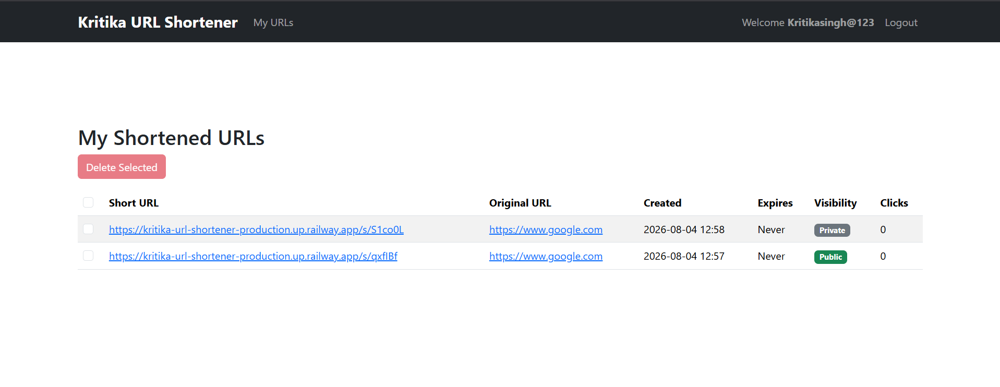

# 🔗 Kritika URL Shortener

A secure full-stack **URL Shortener** application built using **Spring Boot**, **Spring Security**, **PostgreSQL**, **Hibernate**, and **Thymeleaf**. The application allows users to create, manage, and track short URLs with secure authentication, click analytics, URL expiration, and public/private visibility.

---

# 📂 GitHub Repository

🔗 https://github.com/KritikaaSinghh/kritika-url-shortener

---

# ✨ Features

- 🔗 Create Short URLs
- 🔐 User Authentication & Authorization
- 👤 User Registration & Login
- 🌐 Public and Private URLs
- ⏳ URL Expiration Support
- 📊 Analytics Dashboard
- 👆 Click Tracking
- 📈 Top 5 Most Clicked URLs
- 👤 User-specific URL Management
- 🌍 Public URL Listing
- 📱 Responsive UI with Thymeleaf & Bootstrap
- 🗄 PostgreSQL Database Integration

---

# 🛠 Tech Stack

## Backend

- Java 21
- Spring Boot 3
- Spring Security
- Spring Data JPA
- Hibernate
- Flyway

## Database

- PostgreSQL

## Frontend

- Thymeleaf
- HTML5
- CSS3
- Bootstrap

## Tools

- Maven
- Docker
- Git
- GitHub

---

# 📊 Analytics Features

- 📌 Total URLs Created
- 👆 Total Clicks
- 📈 Top 5 Most Clicked URLs
- 🌍 Public URL Listing
- 👤 User Dashboard

---

# 📌 Key Highlights

- Secure authentication using Spring Security
- Database migration using Flyway
- URL click tracking and analytics
- Public & Private URL management
- PostgreSQL integration with Spring Data JPA
- Responsive UI built with Thymeleaf & Bootstrap
- Clean layered architecture following Spring Boot best practices

---

# 📁 Project Structure

```text
src
├── main
│   ├── java
│   │   ├── controller
│   │   ├── service
│   │   ├── repository
│   │   ├── entity
│   │   ├── dto
│   │   ├── config
│   │   ├── security
│   │   └── util
│   └── resources
│       ├── templates
│       ├── static
│       ├── db
│       └── application.properties
└── test
```

---

# ▶️ Run Locally

## 1️⃣ Clone Repository

```bash
git clone https://github.com/KritikaaSinghh/kritika-url-shortener.git
```

## 2️⃣ Move to Project Directory

```bash
cd spring-boot-url-shortener
```

## 3️⃣ Configure PostgreSQL

Update the following file:

```text
src/main/resources/application.properties
```

Example:

```properties
spring.datasource.url=jdbc:postgresql://localhost:5432/urlshortener
spring.datasource.username=postgres
spring.datasource.password=your_password
```

## 4️⃣ Build the Project

```bash
mvn clean install
```

## 5️⃣ Run the Application

Windows

```bash
.\mvnw spring-boot:run
```

Linux / macOS

```bash
./mvnw spring-boot:run
```

## 6️⃣ Open in Browser

```
http://localhost:8080
```

---

# 📸 Screenshots

## 🏠 Home Page


---

## 🔑 Login Page


---

## 📝 Registration Page


---

## 📄 URL Dashboard


---

## 📈 Analytics Dashboard


---

## 🔒 Private URLs



---

# 🚀 Future Enhancements

- 🎯 Custom Short URLs
- 📱 QR Code Generation
- 🔒 Password Protected URLs
- 📧 Email Verification
- ⚡ Redis Cache Integration
- 🚦 Rate Limiting
- 📊 Advanced URL Performance Analytics
- 📖 REST API Documentation using Swagger/OpenAPI

---

# 👩‍💻 Author

**Kritika Singh**

📧 **Email**

singhkritika8449@gmail.com

💼 **LinkedIn**

https://www.linkedin.com/in/kritika8070

💻 **GitHub**

https://github.com/KritikaaSinghh

---

# ⭐ Support

If you found this project useful, please consider giving it a ⭐ on GitHub.

---

## 🙌 Thank You

Thank you for visiting this repository.

If you like this project, don't forget to ⭐ the repository.

Happy Coding! 🚀
